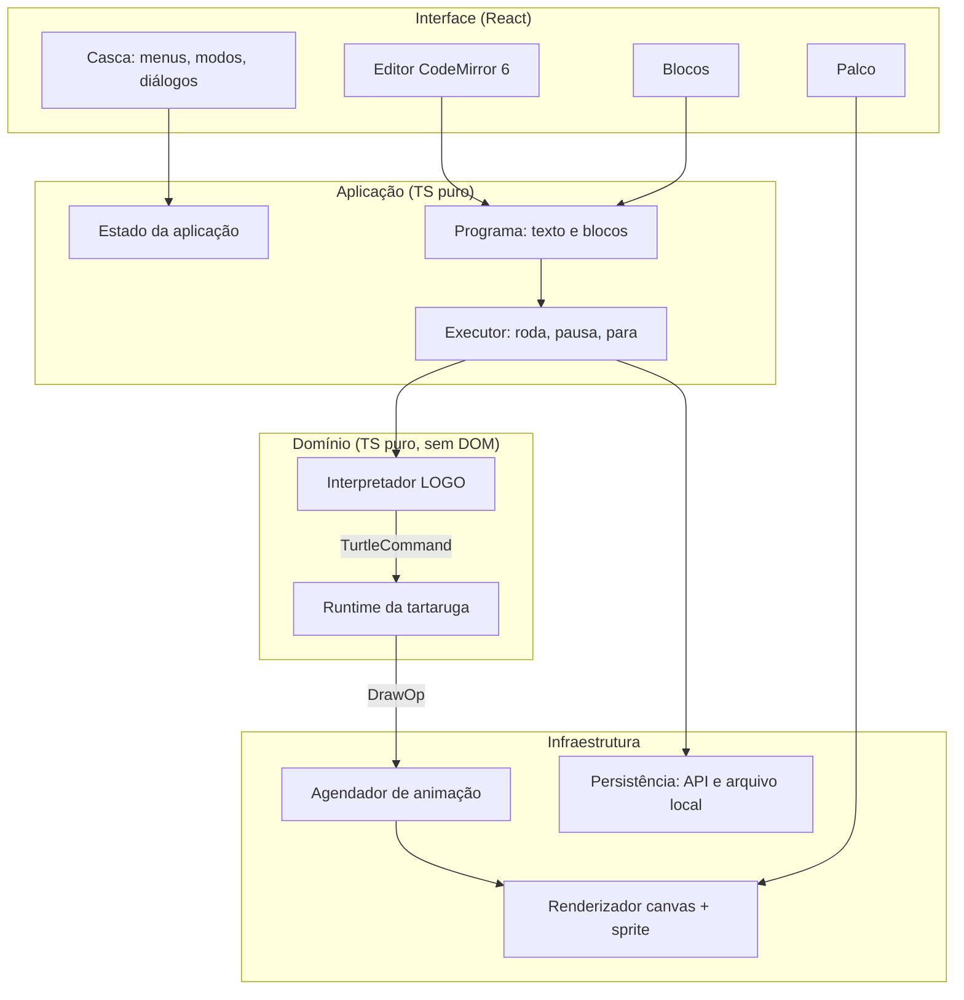

# Arquitetura proposta

Responde à pergunta 4 da issue #2: camadas, módulos, padrões, estado, pastas e documentação. O princípio é um só: **o domínio (LOGO e tartaruga) não conhece o navegador**, e a interface consome o domínio por interfaces pequenas. Tudo que hoje está misturado em `js/init.js`, `js/turtle.js:214` e `js/logo.js:147` passa a ter um lugar.

## 1. Camadas



| Camada | Módulos | Depende de | Testado com |
|---|---|---|---|
| Domínio | `logo/` (tokenizer, parser, AST, interpretador, primitivas), `turtle/` (estado e geometria) | nada | Vitest, sem DOM |
| Aplicação | `program/` (modelo de blocos, serialização, blocos ↔ LOGO), `runner/` (ciclo de execução), `store/` | domínio | Vitest |
| Infraestrutura | `render/` (canvas, sprite), `animation/`, `persistence/` (API, download) | aplicação | Vitest com canvas mock e Playwright |
| Interface | `ui/` (React) | aplicação, infraestrutura | Playwright e Testing Library |

Regra de dependência: uma camada só importa das camadas abaixo. Um lint de import (Biome ainda não tem regra de fronteira; usar `dependency-cruiser` ou uma convenção documentada) evita regressão.

## 2. Domínio: interpretador

### Interfaces de saída

O interpretador atual chama métodos na tartaruga (`js/logo.js:531-537`) e escreve `innerHTML` (`js/logo.js:147`). Na versão nova ele recebe duas interfaces:

```ts
// logo/ports.ts
export interface TurtleCommands {
  forward(d: number): void; backward(d: number): void;
  right(deg: number): void; left(deg: number): void;
  setxy(x: number, y: number): void; setx(x: number): void; sety(y: number): void;
  setheading(deg: number): void; home(): void;
  penup(): void; pendown(): void; penwidth(w: number): void; color(rgb: [number, number, number]): void;
  arc(radius: number, deg: number): void; circle(radius: number): void;
  hideturtle(): void; showturtle(): void;
  clearscreen(): void; clean(): void; reset(): void;
}
export interface TextOutput { print(text: string): void; clear(): void; }
```

O runtime da tartaruga implementa `TurtleCommands`. Um `RecordingTurtle` de teste implementa a mesma interface e só grava as chamadas, o que dá os testes de caracterização do plano.

### AST explícito

Hoje o parser devolve `Token` com `args` aninhados (`js/parser.js:201-207`). A proposta mantém a gramática e a estratégia de "grab" por aridade, mas com tipos discriminados:

```ts
type Node =
  | { kind: 'num'; value: number }
  | { kind: 'word'; name: string; args: Node[] }    // comando ou procedimento
  | { kind: 'var'; name: string }
  | { kind: 'sym'; name: string }
  | { kind: 'list'; items: Node[] }
  | { kind: 'infix'; op: string; left: Node; right: Node }
  | { kind: 'def'; name: string; params: string[]; body: Token[] } // corpo parseado tarde, como hoje
```

Padrões: **Interpreter** (avaliação por `kind`), **Registry** para as primitivas (o `addCommand`/`addPrimitive` atual, tipado) e **Result** para erros: em vez de `new Token('error', msg)` espalhado (`js/logo.js:86`), uma classe `LogoError` com `message` em pt-BR e, quando possível, a posição no texto para o editor sublinhar.

O que **não** muda: nomes e aliases dos comandos, mensagens de erro, limite de recursão 200 (`js/logo.js:33`), gerador de aleatórios (`js/logo.js:36-39`) e a semântica de `stop`/`output`. Isso é o contrato dos testes.

Extensão prevista, fora do escopo inicial: aliases em pt-BR (`pf`, `pt`, `pd`, `pe` como no LOGO brasileiro) entram por uma tabela no registry sem tocar no núcleo.

### Execução cooperativa (etapa própria, depois do porte)

Hoje `Logo.run` roda tudo de uma vez e `DelayTurtle` só adia o desenho (`js/turtle.js:311-333`). Um `forever` sem `stop` trava a aba (`js/logo.js:310-323`). O porte do motor (etapa 3 do plano) **mantém esse modelo**: `run(code)` síncrono, mesma suíte de caracterização verde. Só depois, em etapa própria (etapa 4, ADR-0012), o interpretador ganha uma segunda forma de execução, um **generator** que cede o controle a cada comando de tartaruga:

```ts
function* run(program: string): Generator<TurtleCommand, LogoError | null>
```

O `run` síncrono continua existindo como "drenar o generator até o fim", então os testes não mudam. O `Runner` consome o generator com orçamento de tempo por frame (`requestAnimationFrame`), o que dá pausa, parada, passo a passo e velocidades sem recriar o interpretador (`js/init.js:43-51`). As diferenças de comportamento (por exemplo, `forever` deixa de travar e "Parar" responde na hora) são documentadas e testadas nessa etapa.

## 3. Domínio: runtime da tartaruga

`TurtleState` é um valor imutável `{ x, y, heading, penDown, penWidth, color, visible }`. `TurtleRuntime` aplica um `TurtleCommand` e devolve o novo estado mais uma lista de `DrawOp`:

```ts
type DrawOp =
  | { op: 'line'; from: Point; to: Point; width: number; color: RGB }
  | { op: 'arc'; center: Point; radius: number; start: number; end: number; width: number; color: RGB }
  | { op: 'clear' };
```

Padrão **Command** com log: a lista de `DrawOp` de uma execução é o "desenho". Com ela ficam triviais o undo (esqueleto em `js/turtle.js:32-53`), o redimensionamento do palco, o export para PNG ou SVG e a comparação em testes. A geometria (`js/turtle.js:191-192`, `js/turtle.js:274-278`) vira funções puras testáveis.

## 4. Infraestrutura: renderização e animação

- **`CanvasRenderer`** desenha `DrawOp` num `<canvas>` com `devicePixelRatio` e redesenha do log ao redimensionar. Interface `Renderer` permite um `SvgRenderer` para export (padrão **Strategy**).
- **`SpriteLayer`** posiciona o `` do personagem com `transform: translate() rotate()` e transição CSS. Trocar de personagem é trocar o `src`, como hoje (`js/pinteo7.js:1925`). O sprite é um Strategy do renderizador: cada personagem é só um asset, não uma classe.
- **`AnimationScheduler`** substitui `DelayTurtle`: recebe `DrawOp`s e os aplica com orçamento por frame. Velocidade = ops por frame (lento ≈ 1 px por frame, como `drawbits`; rápido = tudo). Com `prefers-reduced-motion`, o modo padrão vira "sem animação, só resultado".

## 5. Aplicação: programa, blocos e estado

### Modelo de blocos

O DOM deixa de ser o modelo. Cada bloco vira um objeto:

```ts
type Block =
  | { id; kind: 'move'; command: 'forward'|'backward'|'left'|'right'; value: Value }
  | { id; kind: 'setxy'; x: Value; y: Value }
  | { id; kind: 'pen'; command: 'penup'|'pendown'|'reset' }
  | { id; kind: 'color'; rgb: RGB }
  | { id; kind: 'repeat'; times: Value; body: Block[] }
  | { id; kind: 'to'; name: string; body: Block[] }
  | { id; kind: 'call'; name: string }
  | { id; kind: 'make'; name: string; value: Value };
type Value = { kind: 'num'; n: number } | { kind: 'var'; name: string } | { kind: 'op'; op: 'sum'|'difference'|'product'|'divide'; a: Value; b: Value };
```

Isso cobre os tipos que `adicionarCodigo` cria hoje (`js/pinteo7.js:1572-1650`). Serialização:

- `blocksToLogo(blocks): string` substitui `BlocksParser` (`js/pinteo7.js:550-718`) e é uma função pura com teste por bloco.
- `blocksToJson` / `jsonToBlocks` é o formato novo de compartilhamento.
- `importCp7(html): Block[]` lê o formato antigo (`data-code`, `data-what`, `data-value`, `funcao-*`) com `DOMParser` para manter os 34 compartilhados existentes. Não se grava `.cp7` novo.

Blocos → LOGO continua sendo a única direção obrigatória. LOGO → blocos fica como extensão possível (o AST já existe), sem promessa.

### Estado

Um único store (Zustand, ou `useReducer` + context se preferir zero dependência) com fatias pequenas:

```ts
interface AppState {
  mode: 'blocks' | 'text';                 // hoje: #codeblocks visível (js/pinteo7.js:727)
  character: string;                       // hoje: src do <embed> (js/pinteo7.js:1919)
  speed: 'slow' | 'normal' | 'fast';       // hoje: 25 / 5 / 1
  program: { text: string; blocks: Block[] };
  run: { status: 'idle'|'running'|'paused'|'error'; error?: LogoError };
  history: string[];                        // hoje: #oldcode (js/init.js:53)
  ui: { helpOpen: boolean; hintsOn: boolean; characterPickerOpen: boolean };
}
```

Regras: o domínio nunca importa o store; o store só guarda dados serializáveis; efeitos (rodar, salvar) ficam no `Runner` e na persistência, chamados por ações. O log de `DrawOp` da execução atual fica fora do store, num ref, porque muda a cada frame.

Eventos entre módulos: o `Runner` expõe um `EventTarget` tipado (`'progress'`, `'done'`, `'error'`) que a interface assina. Substitui os `myCustomEvent*` (`js/pinteo7.js:412-443`). Padrão **Observer**, sem barramento global.

### Persistência

Interface `ShareStore { save(entry): Promise<Id>; list(): Promise<Summary[]>; load(id): Promise<Entry> }` com duas implementações: `ApiShareStore` (Node) e `LocalShareStore` (`localStorage`, para rodar sem backend e para o deploy estático de hoje). Download de PNG é uma função separada, sem o `onClick` inline de `index.html:448`.

## 6. Interface

React só na casca. Os três componentes pesados embrulham código imperativo:

- `<Stage>`: cria o canvas e o sprite uma vez, passa o `Renderer` ao `Runner`. Redimensiona por `ResizeObserver`.
- `<Editor>`: monta o CodeMirror 6 com a linguagem LOGO e sincroniza com `program.text` por eventos, não por re-render.
- `<BlocksWorkspace>`: renderiza `Block[]` declarativamente; o arrastar e soltar vem do Pragmatic DnD com handlers que despacham ações (`moveBlock`, `setValue`, `removeBlock`).

Diálogos (`personagem`, `ajuda`, `erro`, `compartilhar`) usam `<dialog>` nativo. Texto de interface fica num único módulo `i18n/pt-BR.ts`, para sair dos 30 pontos espalhados listados no inventário.

## 7. Backend

```
api/
  src/
    server.ts           # Hono em @hono/node-server, porta 3000
    routes/shares.ts    # POST /api/shares, GET /api/shares, GET /api/shares/:id
    schemas.ts          # Zod: png base64 ≤ 2 MB, logo ≤ 20 kB, blocks JSON ≤ 200 kB
    storage/fs.ts       # grava em DATA_DIR/<id>.{png,logo,json}; id gerado (ulid)
```

Sem autenticação por enquanto, como hoje, mas com validação, limites de tamanho, rate limit por IP e nomes gerados no servidor. O HTML dos blocos nunca é aceito nem devolvido: o compartilhamento passa a ser JSON validado. Caddy: `handle /api/* { reverse_proxy localhost:3000 }` e `redir` 301 do caminho antigo.

## 8. Organização de pastas

Um único pacote no começo; separar em workspace pnpm (`packages/logo-core`) só se o motor for reutilizado fora do app.

```
pinteo7/
  index.html                 # entrada do Vite
  src/
    logo/                    # domínio: tokenizer.ts, parser.ts, ast.ts, interpreter.ts, primitives/*.ts, errors.ts, ports.ts
    turtle/                  # domínio: state.ts, runtime.ts, geometry.ts, draw-ops.ts
    program/                 # blocks.ts, blocks-to-logo.ts, cp7-import.ts, serialize.ts
    runner/                  # runner.ts (generator + rAF, a partir da etapa 4), events.ts
    legacy-bridge/           # adaptadores que expõem os globais que o legado espera; some na etapa 12
    render/                  # canvas-renderer.ts, svg-renderer.ts, sprite-layer.ts
    animation/               # scheduler.ts, reduced-motion.ts
    persistence/             # share-store.ts, api-share-store.ts, local-share-store.ts, download.ts
    editor/                  # codemirror setup, logo-language.ts
    store/                   # app-state.ts
    ui/                      # React: App.tsx, Stage.tsx, Editor.tsx, BlocksWorkspace.tsx, dialogs/, menu/
    i18n/pt-BR.ts
    main.tsx
  api/                       # backend Node (pacote separado no workspace quando existir)
  public/                    # servido como está; ao fim da migração recebe images/, sounds/, videos/, legendas/
    legacy/                  # a árvore legada inteira (js/, css/, cm/, fonts/, images/, sounds/, videos/, legendas/, styles/, compartilhados/), movida junta na etapa 2 e apagada peça a peça
  tests/
    fixtures/programs/       # programas LOGO de referência + saída esperada
    e2e/                     # Playwright
  docs/
    refatoracao/             # estes documentos
    adr/                     # ADRs aceitos (os propostos ficam em docs/refatoracao/adr até a decisão)
    modulos/                 # um README por módulo de src/
```

## 9. Documentação

- **ADRs** em `docs/adr/NNNN-titulo.md`, formato curto: contexto, decisão, consequências, status (`proposto`, `aceito`, `substituído`). Os desta pesquisa estão em `docs/refatoracao/adr/` com status "proposto"; ao serem aceitos, movem para `docs/adr/`.
- **Doc de módulo**: cada pasta de `src/` tem um `README.md` de até uma página: responsabilidade, o que exporta, o que não faz, como testar. O de `src/logo/` inclui a tabela de comandos do inventário.
- **Contrato do motor**: `docs/logo-comandos.md` gerado a partir do registry (um script `pnpm docs:comandos`), substituindo `comandos-logo.txt` e o `<pre>` de `index.html:620-841`, que hoje divergem.
- **Comentários no código** em pt-BR, JSDoc nas interfaces públicas. Sem comentários que repetem o código.
- `CLAUDE.md` é atualizado a cada etapa do plano para refletir o mapa novo.
